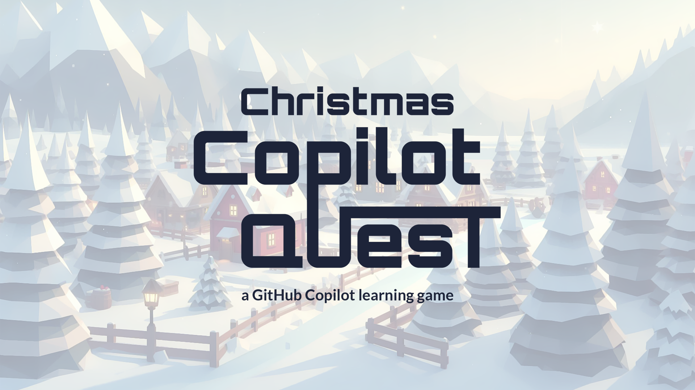
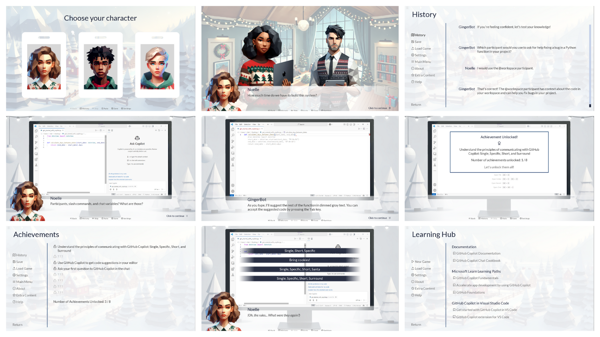
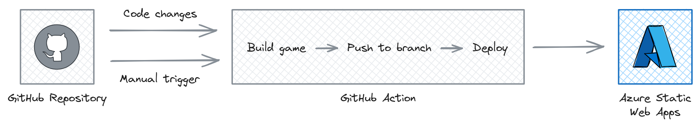

# Christmas Copilot Quest RPG

**Christmas Copilot Quest** is an educational game designed to help you learn how to use GitHub Copilot to assist with coding tasks. Join Santa's Lab and explore GitHub Copilot's features in an interactive and festive journey.



Guided by GingerBot, Santa's friendly GitHub Copilot-powered assistant, you will:

- Install the GitHub Copilot extension in Visual Studio Code.
- Use GitHub Copilot for code development.
- Generate inline code suggestions in your editor.
- Ask questions and receive explanations from GitHub Copilot.
- Create effective prompts to improve code suggestions.



## How It Works

The game is built using [Ren'Py](https://www.renpy.org/), an open-source visual novel engine based on Python. The web version of the game is hosted on [Azure Static Web Apps](https://azure.microsoft.com/products/app-service/static?wt.mc_id=AI-MVP-5004971).



1. The source code for the game is stored in this repository under the `christmas-copilot-quest-rpg` directory.
2. When a new commit is pushed to the `main` branch, a GitHub Actions workflow is triggered to build the web version of the game and deploy it to Azure Static Web Apps.
3. The workflow can also be triggered manually to build and deploy the game to a preview environment, allowing testing before merging changes into the `main` branch.

### Game Structure

The source code for the game is located in the `game` directory in the `christmas-copilot-quest-rpg` folder. The `src` directory contains the game's core components, which include:

- An achievement system, allowing players to earn rewards for completing specific tasks, with achievements being stored persistently.
- Definitions for the game's characters and utility functions enabling players to select their preferred character and name.
- Essential GUI components and utilities, such as custom notification and menu screens, image transformations (e.g., eye blinks), and custom fonts and text styles.
- The game script organized into sections.

### GitHub Actions Workflow

The GitHub Actions workflow automates the game's build and deployment processes through the following jobs:

1. **Build the game using Ren'Py CLI**: The web version of the game is built using the Ren'Py CLI. The generated files are pushed to the `gh-pages` branch. If the `gh-pages` branch does not exist, it is created.
2. **Deploy the game to Azure Static Web Apps**: The `gh-pages` branch is deployed to Azure Static Web Apps using the Azure Static Web Apps GitHub Action.

There are two possible triggers for the workflow:

1. **Automatic trigger on push to `main`**: The workflow is triggered automatically when a new commit is pushed to the `main` branch. The game is built and deployed to the production environment.
2. **Manual trigger**: The workflow can be triggered manually to build and deploy the game to a preview or production environment from any branch. The input parameters required include the source branch (containing Ren'Py game files), target branch (for generated files), and environment name.

### Deployment to Azure Static Web Apps

The creation of the Azure Static Web Apps resource is not automated within the workflow. To create an Azure Static Web Apps resource, you can use the Azure CLI commands below:

```bash
az group create --name christmas-copilot-quest-rpg --location westeurope
az staticwebapp create --name christmas-copilot-quest-rpg --resource-group christmas-copilot-quest-rpg --location westeurope
```

The deployment token for the Azure Static Web Apps resource should be stored as a secret in the GitHub repository with the name `AZURE_STATIC_WEB_APPS_API_TOKEN`.

## Demo

You can play the game online at [Christmas Copilot Quest RPG](https://nice-moss-005f18b03.4.azurestaticapps.net/).

## Behind the Scenes

Explore how this game was created and learn more about the technologies used in the following blog posts:

* [Building the game using Ren'Py and AI tools](https://sfoteini.github.io/blog/building-an-educational-game-with-ai-tools-and-azure-static-web-apps-part-1/)
* [Automating build and deployment with GitHub Actions and Azure Static Web Apps](https://sfoteini.github.io/blog/building-an-educational-game-with-ai-tools-and-azure-static-web-apps-part-2/)

## Note on AI Tools Usage

Graphics for this game were partially created using AI tools, and the text has been refined with the Azure OpenAI Service to ensure clarity and accuracy.
